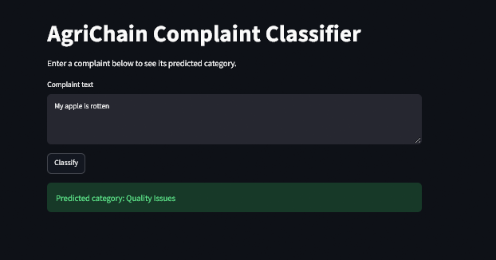
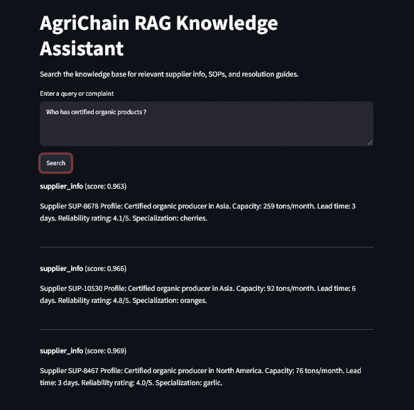
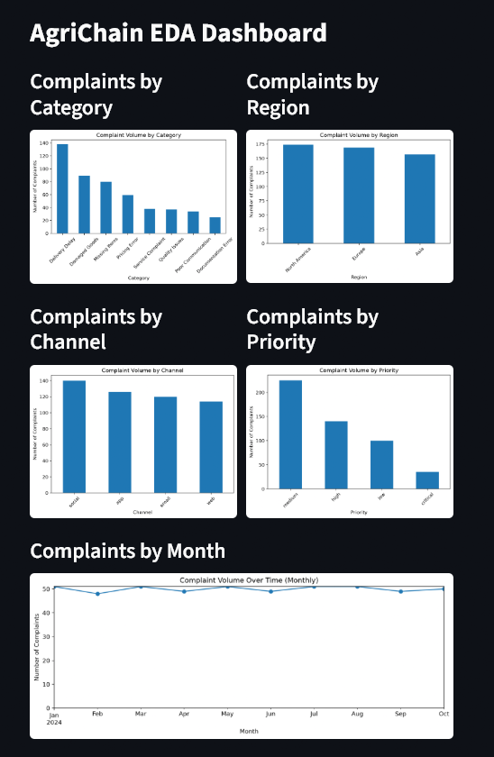
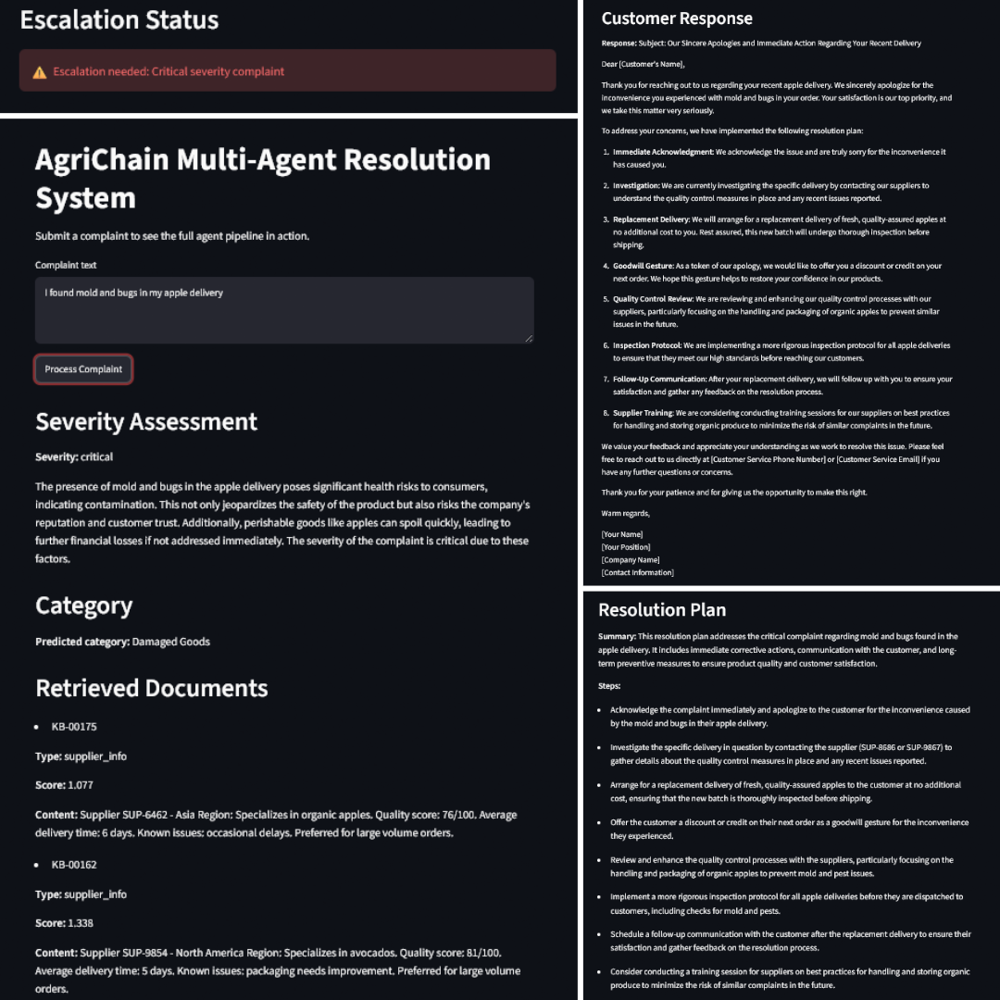

# AgriChain: AI Complaint Resolution for an Agricultural Supply Chain

AgriChain takes in a customer complaint and runs it through a 5-agent pipeline. It figures out what kind of complaint it is and how serious it is, looks up relevant policy and past resolutions, comes up with a plan, drafts a response, and flags it if it needs a human to step in. Built as my capstone project for Fullstack Academy's AI/ML program.

## What it does

Handling complaints manually is slow and inconsistent. Different people might classify the same complaint differently, miss that something's urgent, or forget to check the SOP for a similar past case. AgriChain automates that whole process:

1. **Classify** the complaint into one of 8 categories with a trained ANN
2. **Assess severity**, combining the classifier's output with the LLM's judgment
3. **Retrieve** relevant SOPs and past resolutions from a FAISS-backed knowledge base
4. **Plan** an actual resolution
5. **Draft** a response a human could send
6. **Flag** it for escalation if it's serious enough

The end result is a structured report that a support or ops person would review before acting on it, since this isn't meant to auto-send anything to a customer on its own. Four Streamlit apps give different views into the system (see below).

## Architecture

The 5 agents run in a fixed, predictable order every time a complaint comes in:

```
Complaint → Analyzer → Investigator → Planner → Communicator → Escalation Manager → Resolution Report
```

| Agent                  | What it does                                                   |
| ---------------------- | -------------------------------------------------------------- |
| **Analyzer**           | Runs the ANN for category, then asks the LLM to judge severity |
| **Investigator**       | Pulls relevant docs from the FAISS knowledge base              |
| **Planner**            | Writes out a step-by-step resolution plan                      |
| **Communicator**       | Drafts the customer-facing response                            |
| **Escalation Manager** | Flags the case if it's bad enough                              |

The graph stays linear rather than using a conditional edge. `escalate` is just a boolean on the shared state, which keeps the graph itself simple and puts all the branching logic in one place: the Escalation Manager. Escalation only fires on `severity == "critical"`, not `"high"`, so it stays reserved for cases that actually need a person's attention right away instead of firing on every moderately bad complaint.

## Tech Stack

- **ML / embeddings:** Keras (the ANN), `sentence-transformers` (`all-MiniLM-L6-v2`)
- **Retrieval:** FAISS, LangChain
- **Agents:** LangGraph, LangChain, OpenAI `gpt-4o-mini`
- **Apps:** Streamlit
- **Deployment:** Docker, Docker Compose

## Project Structure

- `data/` — raw complaint/knowledge base data, plus processed embeddings and sample reports
- `models/` — the trained classifier, label encoder, class weights, and FAISS index
- `notebooks/` — the pipeline that built everything, run in order: explore the raw data, generate embeddings and train the classifier, build the FAISS knowledge base, then wire up and test the 5 agents. Each notebook loads data saved by the one before it rather than starting from scratch.
- `src/` — the actual application code: agents, state schema, classifier and retrieval helpers, the compiled graph
- `streamlit_apps/` — the four Streamlit apps
- `Dockerfile`, `docker-compose.yml`, `pyproject.toml`, `requirements.txt` — build and dependency config

## Setup

### You'll need

- Docker Desktop (free for personal/school use)
- An OpenAI API key

### Option 1: Docker

1. Make a `.env` file in the project root:
   ```
   OPENAI_API_KEY=your_key_here
   ```
2. Build and run all four apps:
   ```bash
   docker compose up
   ```
3. Open whichever app you want in your browser (ports below).

### Option 2: Run it locally instead

```bash
python -m venv venv
source venv/Scripts/activate   # Git Bash on Windows
pip install -r requirements.txt
pip install -e .
```

Same `.env` file with `OPENAI_API_KEY`, then run any app directly:

```bash
streamlit run streamlit_apps/multi_agent_system.py
```

## The Apps

| App                     | Port   | What it's for                                                 |
| ----------------------- | ------ | ------------------------------------------------------------- |
| Complaint Classifier    | `8501` | Type in a complaint, see what category the ANN predicts       |
| RAG Knowledge Assistant | `8502` | Search the SOP/resolution knowledge base directly             |
| EDA Dashboard           | `8503` | Complaint trends by region, channel, time, priority           |
| Multi-Agent System      | `8504` | The real thing. Submit a complaint and watch all 5 agents run |

## Screenshots

**Complaint Classifier**


**RAG Knowledge Assistant**


**EDA Dashboard**


**Multi-Agent System**


## Model Performance

Tested the ANN on a held-out set of 50 complaints it never saw during training:

| Metric                                     | Score |
| ------------------------------------------ | ----- |
| Accuracy                                   | 100%  |
| Precision / Recall / F1 (all 8 categories) | 1.00  |

A 100% test accuracy was unusual, so I checked for data leakage by looking for duplicate complaint text between the training and test sets and found none. The dataset also has a relatively small test set and uses clear wording for each category, making the classification task easier than it would be with more varied customer complaints. As another check, I ran five new complaint examples through the full LangGraph agent pipeline, and all five were classified correctly.

## Known Limitations

**The knowledge base composition messes with retrieval.** Supplier profile documents make up about 73% of the knowledge base (200 of 274 docs), versus only 24 resolution guides and 50 SOPs. Since they're the overwhelming majority, the similarity search sometimes pulls back a supplier profile instead of the resolution guide you would want for customer resolution reports.

## Sample Output

`data/processed/sample_resolution_reports.json` has 5 real test complaints run through the full pipeline, with predicted category and severity sitting next to the actual ground-truth labels so you can see how it did.

## Author

Built as a capstone project for Fullstack Academy's AI/ML program.
